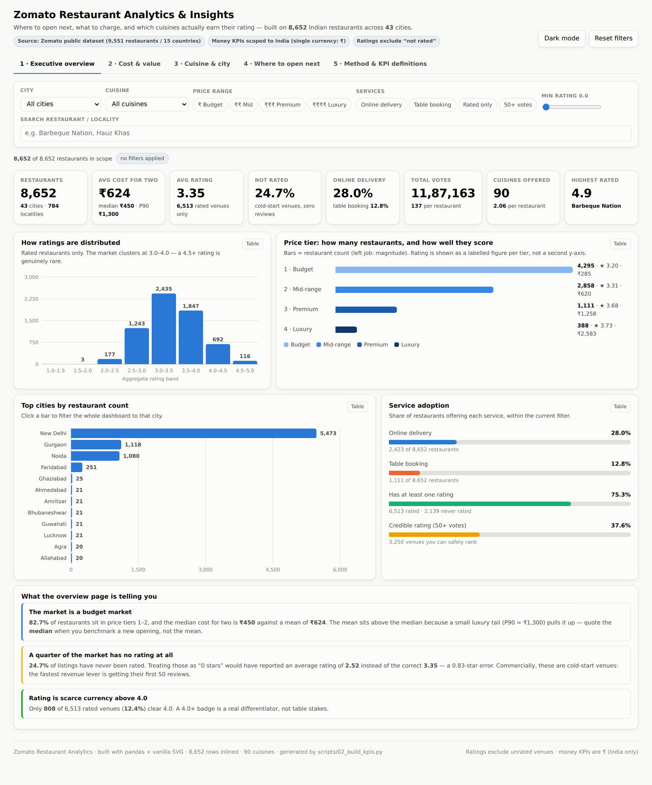
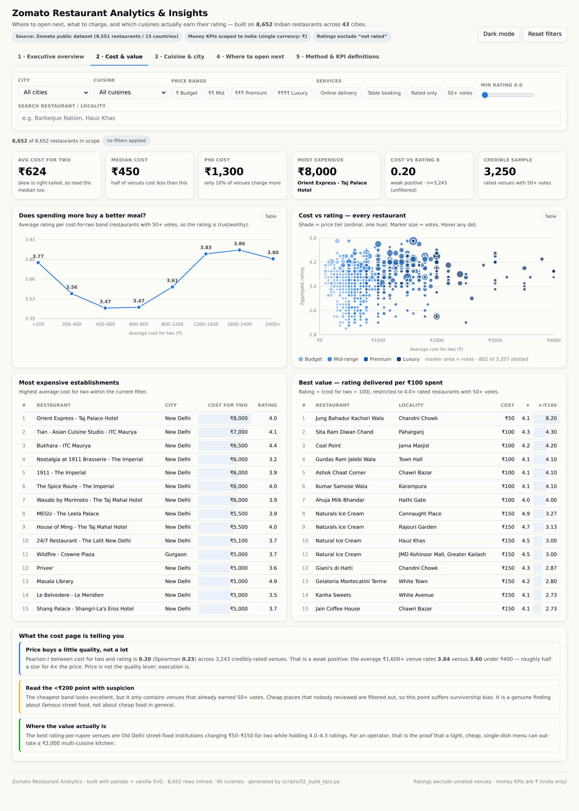
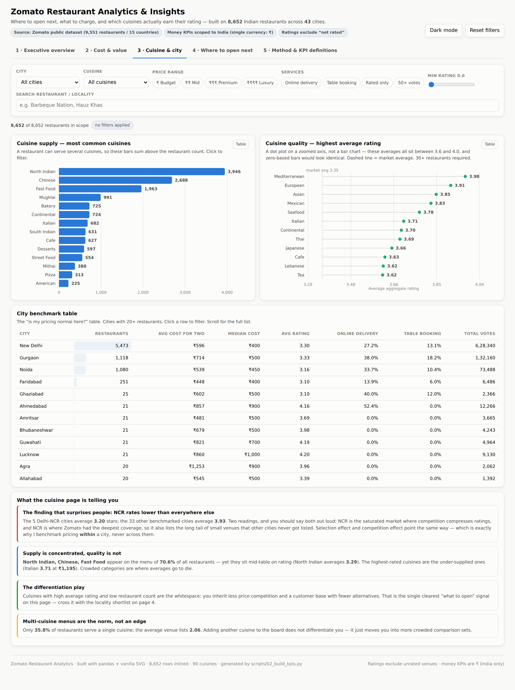
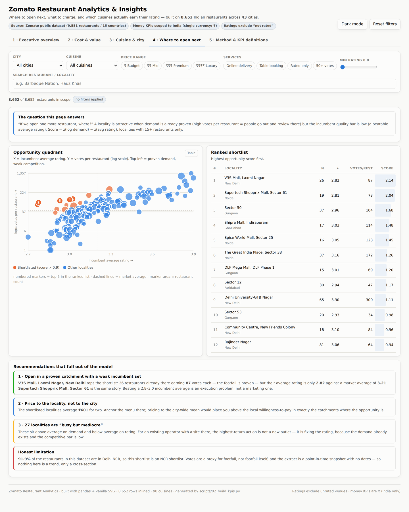
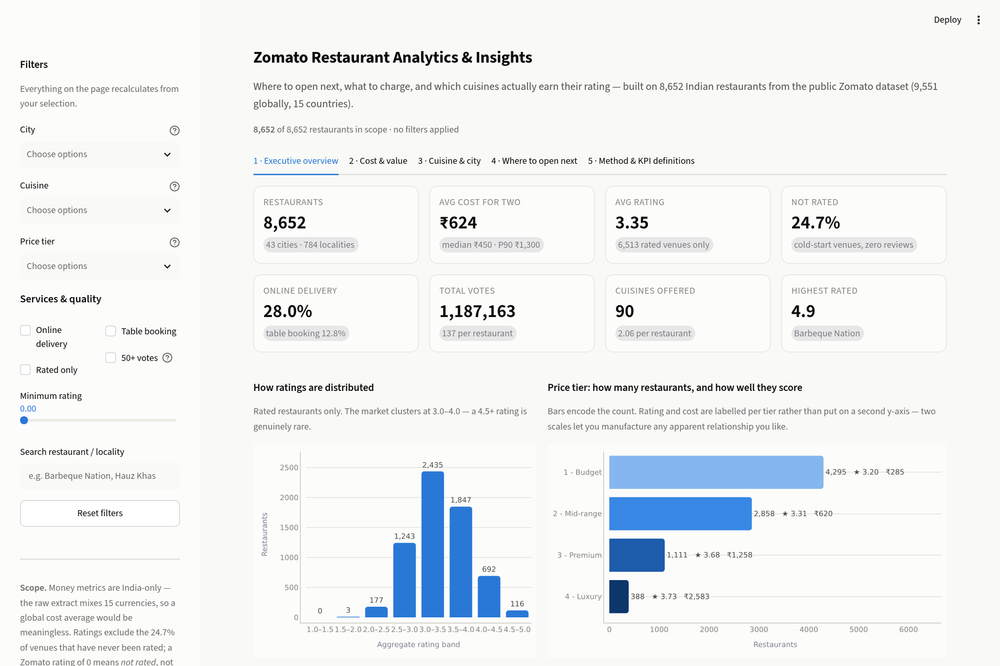
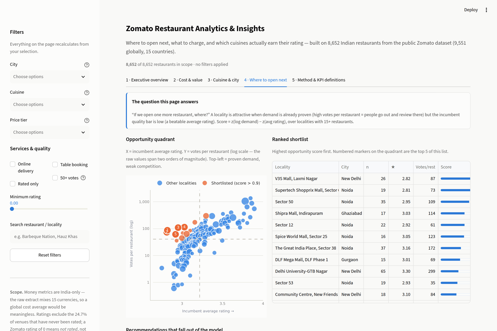

# Restaurant Data Analytics & Insights — Zomato

**An end-to-end restaurant analytics project: a reproducible Python pipeline, a
Power BI data model, and an interactive dashboard that answers three commercial
questions — where to open next, what to charge, and which cuisines actually earn
their rating.**


---

## 60-second summary

| | |
|---|---|
| **Dataset** | Zomato Restaurants Data (Kaggle, 9,551 restaurants / 15 countries) |
| **Rows analysed** | **9,551** restaurants globally · **8,652** in India (the analysis scope) |
| **Coverage** | 43 Indian cities · 784 localities · 90 distinct cuisines |
| **Headline benchmark** | Average cost for two **₹624**, median **₹450**, P90 **₹1,300** |
| **Average rating** | **3.35** across 6,513 rated venues (24.7% have never been rated) |
| **Service adoption** | online delivery **28.0%** · table booking **12.8%** |
| **Engagement** | **1,187,163** total votes · 137 per restaurant |
| **Deliverables** | 5-page interactive dashboard · Power BI model + full DAX · reproducible pipeline · 19 automated checks |

**Three ways to see it:**

| | |
|---|---|
| **Live app** | Deploy `streamlit_app.py` to [Streamlit Community Cloud](https://share.streamlit.io) — free, ~3 minutes, gives you a public URL. See [`docs/STREAMLIT_DEPLOY.md`](docs/STREAMLIT_DEPLOY.md). |
| **Download and open** | [`dashboard/zomato_dashboard.html`](dashboard/zomato_dashboard.html) — one file, no server, no install, no internet. The data is baked in. |
| **Build it in Power BI** | [`docs/POWERBI_GUIDE.md`](docs/POWERBI_GUIDE.md) — data model, Power Query steps, every DAX measure, page-by-page layout. |

```bash
pip install -r requirements.txt
streamlit run streamlit_app.py     # http://localhost:8501
```

---

## Dashboard

| | |
|---|---|
|  |  |
| **Page 1 — Executive overview.** KPI strip, rating distribution, price-tier mix, city ranking, service adoption. | **Page 2 — Cost & value.** Does spending more buy a better meal? Cost-vs-rating scatter, most expensive and best-value leaderboards. |
|  |  |
| **Page 3 — Cuisine & city.** Supply vs quality by cuisine, and the "is my pricing normal here?" city benchmark table. | **Page 4 — Where to open next.** A scored locality shortlist from a demand-vs-quality opportunity model. |

### The same five pages as a Streamlit app

| | |
|---|---|
|  |  |
| Sidebar slicers, `st.metric` KPI strip, Plotly charts. | The opportunity quadrant on a log axis, with the ranked shortlist beside it. |

Every page shares one filter bar — city, cuisine, price tier, services, minimum
rating, free-text search — and every KPI, chart and table recalculates from the
row-level data, exactly like a Power BI report. Clicking a bar or a table row
cross-filters the whole page. There is a dark mode, every chart has a
table-view toggle for screen-reader and print users, and page 5 documents every
KPI definition.

---

## The five questions this project answers

### 1. What does eating out actually cost?

Average cost for two is **₹624**, but the distribution is
right-skewed (skew ≈ 3.59), so the **median of ₹450**
is the number you should benchmark against. Only 10% of venues charge more than
₹1,300. Half the market (49.6%) sits in
the lowest price tier at an average of ₹285 for two.

| Price tier | Restaurants | Share | Avg cost for two | Avg rating | Online delivery | Table booking |
|---|--:|--:|--:|--:|--:|--:|
| 1 - Budget | 4,295 | 49.6% | ₹285 | 3.20 | 16.3% | 0.0% |
| 2 - Mid-range | 2,858 | 33.0% | ₹620 | 3.31 | 44.8% | 8.2% |
| 3 - Premium | 1,111 | 12.8% | ₹1,258 | 3.68 | 35.8% | 56.2% |
| 4 - Luxury | 388 | 4.5% | ₹2,583 | 3.73 | 11.1% | 64.7% |

### 2. Who are the top-rated and most expensive establishments?

**Top rated** (rating ties broken by vote count; minimum 50 votes so a
4.9-from-3-reviews cannot win):

| # | Restaurant | City | Cost for two | Rating | Votes |
|--:|---|---|--:|--:|--:|
| 1 | Barbeque Nation | Kolkata | ₹1,600 | 4.9 | 5,966 |
| 2 | AB's - Absolute Barbecues | Hyderabad | ₹1,500 | 4.9 | 5,434 |
| 3 | Mirchi And Mime | Mumbai | ₹1,500 | 4.9 | 3,244 |
| 4 | Naturals Ice Cream | New Delhi | ₹150 | 4.9 | 2,620 |
| 5 | Indian Accent - The Manor | New Delhi | ₹4,000 | 4.9 | 1,934 |

**Most expensive:**

| # | Restaurant | City | Cost for two | Rating |
|--:|---|---|--:|--:|
| 1 | Orient Express - Taj Palace Hotel | New Delhi | ₹8,000 | 4.0 |
| 2 | Tian - Asian Cuisine Studio - ITC Maurya | New Delhi | ₹7,000 | 4.1 |
| 3 | Bukhara - ITC Maurya | New Delhi | ₹6,500 | 4.4 |
| 4 | The Spice Route - The Imperial | New Delhi | ₹6,000 | 4.0 |
| 5 | Wasabi by Morimoto - The Taj Mahal Hotel | New Delhi | ₹6,000 | 3.9 |

### 3. Does paying more get you a better meal?

Barely. Pearson **r = 0.205** (Spearman 0.228) between cost
for two and aggregate rating across 3,243 credibly-rated venues.
Average rating rises from **3.56** in the ₹200–400 band to
**3.86** in the ₹1,600–2,400 band — roughly a third of a star for
six times the price.

The strongest correlate of rating is not price, it is **attention**:
log(votes) correlates with rating at **r = 0.463**, more than
double the price correlation. Venues that get reviewed get rated well; the
causality runs both ways and neither direction is price.

The best rating-per-rupee venues are Old Delhi street-food institutions:

| # | Restaurant | Locality | Cost for two | Rating | Stars per ₹100 |
|--:|---|---|--:|--:|--:|
| 1 | Jung Bahadur Kachori Wala | Chandni Chowk | ₹50 | 4.1 | 8.20 |
| 2 | Sita Ram Diwan Chand | Paharganj | ₹100 | 4.3 | 4.30 |
| 3 | Cool Point | Jama Masjid | ₹100 | 4.2 | 4.20 |
| 4 | Kumar Samose Wala | Karampura | ₹100 | 4.1 | 4.10 |
| 5 | Ashok Chaat Corner | Chawri Bazar | ₹100 | 4.1 | 4.10 |

### 4. Which cuisines are crowded, and which are rewarded?

**North Indian, Chinese, Fast Food** appear on the menu of **70.6%** of all
restaurants, yet they sit mid-table on rating (3.29 for
North Indian). The highest-rated cuisines are the under-supplied ones:

| Cuisine | Restaurants | Avg rating | Avg cost for two |
|---|--:|--:|--:|
| Mediterranean | 90 | 3.98 | ₹1,556 |
| European | 119 | 3.91 | ₹1,932 |
| Asian | 186 | 3.85 | ₹1,455 |
| Mexican | 130 | 3.83 | ₹1,053 |
| Seafood | 81 | 3.78 | ₹1,383 |
| Italian | 682 | 3.71 | ₹1,195 |

Only **35.8%** of restaurants serve a single cuisine — the
average venue lists 2.06. Adding another cuisine to the
board is not differentiation; it moves you into more crowded comparison sets.

### 5. Where should the next restaurant open?

A locality is attractive when demand is already proven but the incumbent quality
bar is beatable:

```
opportunity_score = z( log(1 + votes per restaurant) ) − z( average rating )
```

scored over localities with at least 15 restaurants. The log matters: raw
votes-per-restaurant is so skewed that without it one locality dominates the
score and the quality term becomes decorative.

| # | Locality | City | Restaurants | Avg rating | Votes / restaurant | Avg cost | Score |
|--:|---|---|--:|--:|--:|--:|--:|
| 1 | V3S Mall, Laxmi Nagar | New Delhi | 26 | 2.82 | 87 | ₹631 | 2.14 |
| 2 | Supertech Shopprix Mall, Sector 61 | Noida | 19 | 2.81 | 73 | ₹713 | 2.05 |
| 3 | Sector 50 | Noida | 35 | 2.95 | 109 | ₹607 | 1.76 |
| 4 | Sector 12 | Noida | 22 | 2.92 | 62 | ₹345 | 1.49 |
| 5 | Shipra Mall, Indirapuram | Ghaziabad | 17 | 3.03 | 114 | ₹729 | 1.48 |
| 6 | Spice World Mall, Sector 25 | Noida | 16 | 3.05 | 123 | ₹662 | 1.45 |

**Recommendations that fall out of the model**

1. **Target proven catchments with weak incumbents.** V3S Mall, Laxmi Nagar (New Delhi)
   has 26 restaurants pulling 87 votes each — the
   footfall is proven — at an average rating of only 2.82 against a market
   average of 3.35. Beating a 2.8 incumbent average is an execution
   problem, not a marketing one.
2. **Price to the locality, not the city.** The shortlist averages
   ₹614 for two. Pricing to the city-wide mean would put
   you above local willingness-to-pay in exactly the catchments where the
   opportunity is.
3. **Differentiate on cuisine, not on breadth.** Cross the locality shortlist with the
   high-rating / low-supply cuisines above (Mediterranean, European,
   Mexican) rather than opening another North Indian + Chinese multi-cuisine.
4. **For venues that already exist, fix the rating first.** 24.7% of listings
   have never been rated. In a market where 0.463 is the
   votes-to-rating correlation, the first 50 reviews are the cheapest revenue
   lever available.
5. **Table booking is the premium signal, delivery is the mid-market signal.**
   Table booking runs 64.7% in the luxury tier vs
   0.0% in budget; online delivery peaks in the
   *mid-range* tier at 44.8% and falls back to
   11.1% at luxury. Match the service to the tier you are
   entering instead of buying both.

---

## What makes this defensible rather than just pretty

These are the decisions an interviewer should ask about, and they are all
documented in the code.

**1. `Aggregate rating = 0` means "not rated yet", not "zero stars".**
2,139 venues (24.7%) carry a zero. Averaging them in
reports **2.52**; excluding them reports the correct
**3.35** — a 0.83-star error, which would have made
every city and cuisine comparison wrong in proportion to how many unrated
listings it happened to contain.

**2. Money metrics are scoped to a single currency.** The raw extract spans 15
countries and 15 currencies. Averaging ₹ with $ produces a number with no
meaning, so all cost KPIs are filtered to India (8,652 rows). Currency-free
metrics — price tier 1–4, rating, service flags — are also reported globally on
a separate page.

**3. Leaderboards carry a credibility floor.** Top-rated requires ≥
50 votes; city benchmarks ≥ 20 restaurants; cuisine rankings ≥ 30;
locality scoring ≥ 15. Without these, every "top 10" is a list of venues with
three reviews.

**4. Cuisines are modelled as a many-to-many bridge table**, not a delimited
string. Cuisine bars therefore sum to more than the restaurant count — correct,
and stated on the chart.

**5. The honest limitation is stated up front.** **91.9%** of the
Indian rows are Delhi NCR, so national conclusions are really NCR conclusions.
NCR also rates lower (3.20 average) than the 33 other benchmarked cities
(3.93) — partly saturation, partly a coverage artefact, and both readings
belong in the answer. There are no timestamps in the extract, so nothing here is
a trend; it is a cross-section.

---

## Repository layout

```
zomato-restaurant-analytics/
├── README.md                        this file
├── requirements.txt
├── LICENSE
├── Makefile                         `make all` runs the whole pipeline
├── data/
│   ├── raw/zomato.csv               source extract (9,551 x 21)
│   └── processed/                   star schema written by stage 1
│       ├── fact_restaurants.csv     1 row per restaurant
│       ├── dim_country.csv          country code -> name + currency
│       ├── bridge_cuisine.csv       restaurant -> cuisine (many-to-many)
│       ├── dim_price_range.csv
│       ├── agg_*.csv                pre-aggregated tables for Power BI / Excel
│       └── data_quality_log.csv     audit trail: every row changed, and why
├── scripts/
│   ├── 00_download_data.sh          fetch the raw extract
│   ├── 01_clean_data.py             raw -> clean star schema
│   ├── 02_build_kpis.py             star schema -> kpis.json + aggregates
│   ├── 03_build_dashboard.py        bake data into a single-file dashboard
│   ├── 04_verify_dashboard.mjs      19 headless checks + screenshots
│   └── 05_write_docs.py             regenerate README + docs from kpis.json
├── streamlit_app.py                 the Streamlit app (deploy this)
├── .streamlit/config.toml           Streamlit theme, same tokens as the dashboard
├── app/
│   └── measures.py                  shared measure layer used by the app + tests
├── tests/
│   ├── test_streamlit_measures.py   38 checks: app measures vs the pipeline
│   └── test_streamlit_app.mjs       18 checks: the app in headless Chromium
├── dashboard/
│   ├── _template.html               dashboard source (charts, measures, layout)
│   ├── kpis.json                    every number, written by stage 2
│   └── zomato_dashboard.html        ← the deliverable, open this
├── powerbi/
│   └── README.md                    where the .pbix lives + how to rebuild it
├── docs/
│   ├── POWERBI_GUIDE.md             full Power BI rebuild: model, DAX, layout
│   ├── STREAMLIT_DEPLOY.md          deploy to Streamlit Community Cloud
│   ├── INTERVIEW_PREP.md            every KPI explained + 25 likely questions
│   └── verification_report.json     output of stage 4
└── assets/                          dashboard screenshots (generated)
```

## Reproducing it

```bash
git clone https://github.com/<your-username>/zomato-restaurant-analytics.git
cd zomato-restaurant-analytics
pip install -r requirements.txt

bash scripts/00_download_data.sh      # fetch the raw extract
python scripts/01_clean_data.py       # -> data/processed/*.csv
python scripts/02_build_kpis.py       # -> dashboard/kpis.json
python scripts/03_build_dashboard.py  # -> dashboard/zomato_dashboard.html
python scripts/05_write_docs.py       # -> README.md, docs/*.md

streamlit run streamlit_app.py        # the live app on localhost:8501

npm i playwright                      # optional: run the verification suites
node scripts/04_verify_dashboard.mjs  # 20 checks on the HTML dashboard
python tests/test_streamlit_measures.py   # 38 checks on the app's measures
node tests/test_streamlit_app.mjs         # 18 checks on the running app
```

Or just `make all`, then `make verify`.

## Verification

The pipeline is not trusted on sight. `scripts/04_verify_dashboard.mjs` drives the
built dashboard in headless Chromium and asserts:

- the page loads from `file://` with **zero** console errors
- all 8 KPI tiles render, and the headline values match the pipeline exactly
- all five pages draw SVG marks rather than empty containers
- **the browser's JavaScript measures agree with the pandas pipeline on all 11
  reference KPIs** — this is the important one; the dashboard recomputes
  everything client-side, so a mismatch would mean the two implementations of the
  same measure had diverged
- slicers, chart-click cross-filtering, reset, table-view toggles and dark mode
  all behave
- screenshots are captured for this README

The Streamlit app gets the same treatment. `tests/test_streamlit_measures.py`
asserts that `app/measures.py` reproduces all 13 reference KPIs, both correlation
statistics, the opportunity model's top-2 localities and every threshold, and that
the filter layer narrows correctly and returns empty rather than throwing on an
impossible selection. `tests/test_streamlit_app.mjs` then drives the running app in
headless Chromium: KPI tiles, all five tabs rendering charts, and the city slicer
actually recomputing the metrics.

| Suite | What it checks | Status |
|---|---|--:|
| `scripts/04_verify_dashboard.mjs` | HTML dashboard in a browser, incl. pandas ↔ JS reconciliation | **20/20** |
| `scripts/06_verify_docs.py` | no figure in any document has drifted from the data | **69/69** |
| `tests/test_streamlit_measures.py` | app measures vs the pipeline | **38/38** |
| `tests/test_streamlit_app.mjs` | the running Streamlit app in a browser | **18/18** |

**145 checks, all passing.**

Why three front-ends is a feature and not indecision: the measures now exist in
three independent implementations — pandas, vanilla JavaScript and the Streamlit
measure layer — and the suites assert they agree. Two implementations agreeing is
real evidence the measure logic is right. One implementation rendering without
errors is not.

## Tech

**Python** (pandas, numpy) for the pipeline · **Power BI Desktop** (Power Query +
DAX) for the modelled report, documented in `docs/POWERBI_GUIDE.md` ·
**vanilla JavaScript + SVG** for the single-file dashboard — no chart library and
no CDN, so it works offline forever · **Streamlit + Plotly** for the deployable
web app · **Playwright** for browser verification.

The dashboard palette is validated for colour-vision deficiency: categorical
hues are assigned in a fixed order that clears a ΔE ≥ 8 CVD-separation gate in
both light and dark mode, price tiers use a single-hue ordinal ramp because they
are ordered rather than categorical, and every chart ships a table view because
three of the light-mode hues sit below 3:1 contrast against the surface.

## Licence

MIT — see [LICENSE](LICENSE). The Zomato dataset is used under the terms of its
original public release.
